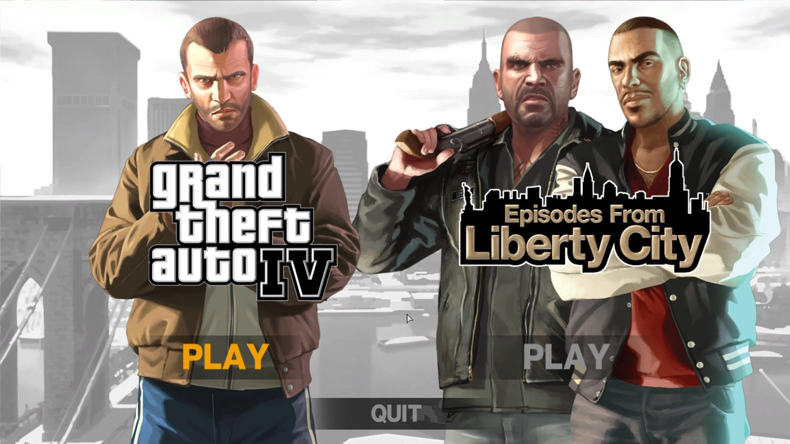
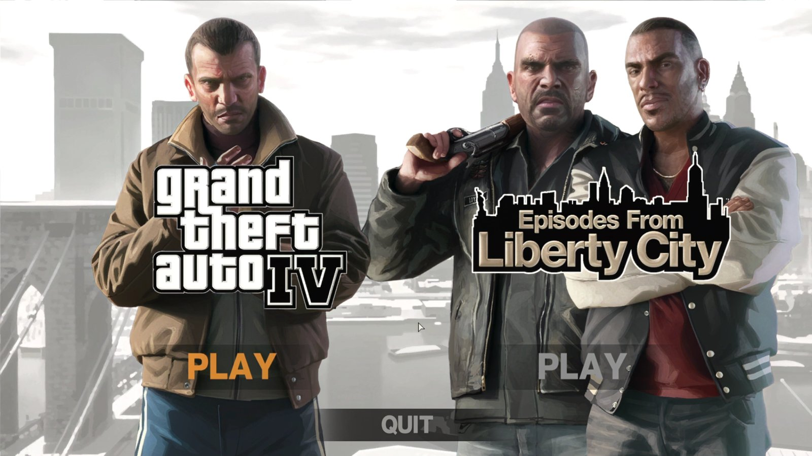
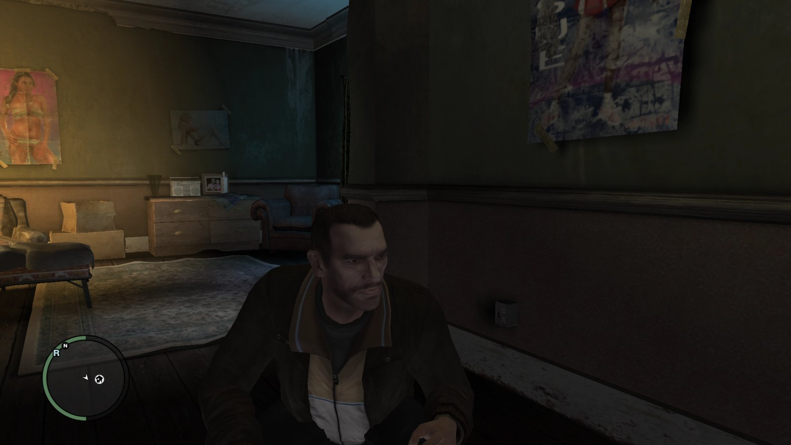
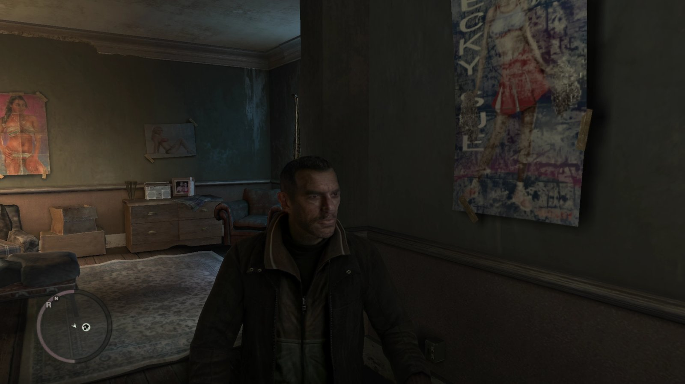

# DLSS5_INTEL

**DLSS 5 Neural Rendering, running live on Intel Arc — a fan research project.**

This project takes the real DLSS 5 neural-rendering model (the 71-block DLSSNR
graph) and runs it on **Intel Arc GPUs** through Vulkan (`VK_KHR_cooperative_matrix`,
XMX cores) instead of NVIDIA tensor cores. It processes **live game frames at
present time** — for Vulkan titles through an implicit Vulkan layer, for
DirectX 9/10/11 through DXVK + the same layer, and for DirectX 12 through a
custom DXGI proxy. A screen/window mode processes the whole desktop or one
window through DDA capture and a click-through Vulkan overlay.

> ⚠️ **Fan project. Not a product.** Not affiliated with or endorsed by NVIDIA
> or Intel. We do **not** use any NVIDIA source code, and we do **not**
> distribute the model weights (NVIDIA proprietary data). DLSS and NVIDIA are
> trademarks of NVIDIA Corporation. Everything here is research and engineering
> demonstration.

[Русская версия README](README.ru.md)

---

## Current status — honest demo build

This is a working proof-of-concept, not a usable everyday tool. What you should
expect today:

| Area | Status |
|---|---|
| Vulkan games (implicit layer) | ✅ Works — validated end-to-end on vkcube; untested in real Vulkan titles yet |
| DX9 / DX10 / DX11 games (via DXVK → Vulkan) | ✅ Works — validated live on GTA IV (DX9, 32-bit) |
| DX12 games (own `dxgi.dll` proxy) | ✅ Works mechanically — validated on windowed DX12 titles |
| Auto-deploy of the right DLLs per game | ✅ Works — API auto-detection, per-mode DLL set, one UAC prompt for Program Files games |
| Auto game discovery | ✅ Works — Steam / Epic / GOG manifests + full-drive scan, PE-based API detection (finds real games, not every `.exe`) |
| In-game overlay (sliders on a frozen frame) | 🟡 Partial — opens with `CTRL+ALT+G`, mouse capture/release fights with some games; exclusive fullscreen may minimize the game |
| Screen / window mode (whole desktop) | 🟡 Works, but slow and rough — fine for streaming demos, not for daily use |
| **FPS** | ❌ **Not playable — a slideshow.** The chain is ~135 ms/frame at 500×500 and ~0.9–1.1 s/frame at 1080p-class resolutions (GEMM-bound). Screen mode at 1440p takes tens of seconds for the first frame |
| Pause / resume | ✅ `CTRL+ALT+X` — full game FPS while paused |

The performance debt is the known core problem (see
[docs/ARCHITECTURE.md](docs/ARCHITECTURE.md#performance)); the correctness of
the neural path is validated bit-exactly against PyTorch goldens.

## Before / after

Every frame below is an unretouched full-screen capture of **GTA IV** running
through the whole live pipeline (DX9 → DXVK → Vulkan layer → TCP daemon →
71-block DLSSNR chain on the GPU → back into the swapchain), streamed over
Sunshine/Moonlight.

**▶ [Open the interactive comparison slider](docs/compare.html)**
(drag the divider left/right; best experienced with GitHub Pages enabled —
`Settings → Pages → docs/`)

| | |
|---|---|
|  |  |
| *1 — Main menu, before* | *1 — Main menu, after* |
|  |  |
| *3 — Loading intro, before* | *3 — Loading intro, after* |
|  |  |
| *6 — In-game (safehouse), before* | *6 — In-game (safehouse), after* |

All 7 pairs (menu, 4 loading screens, 2 in-game) are in
[docs/screenshots](docs/screenshots) and in the slider page.

## How it works (short version)

```
game frame ──present──► ┌ Vulkan implicit layer / DXGI proxy / DDA capture ┐
                        │ 16-byte header + BGRA payload, TCP 127.0.0.1:47990 │
                        └──────────────► m11d daemon ◄───────────────────────┘
                                       decode → features → featpack
                                       → 71-block DLSSNR chain (~GEMM-bound)
                                       → head → residual → high-pass
                                       → echo-cancel feedback accumulate
                                       → compose (gain + blend knobs)
                                       → encode → readback ──► back into the swapchain
```

- **Vulkan games** — an implicit Vulkan layer intercepts `vkQueuePresentKHR`,
  round-trips the frame to the daemon, writes the processed frame back.
- **DX9/10/11** — per-game DXVK deployment routes D3D through Vulkan, then the
  same layer applies.
- **DX12** — a proxy `dxgi.dll` (vtable hook on `Present`) does the same
  round-trip directly.
- **Screen/window mode** — DDA desktop duplication → CPU bridge → the same
  chain → fullscreen topmost click-through Vulkan overlay.
- **Manager (M13)** — a stdlib-only Python/Tk app: auto-setup, game scan,
  per-game deploy/launch, two live knobs, in-game overlay, EN/RU UI.

Full details, module map and the performance breakdown:
[docs/ARCHITECTURE.md](docs/ARCHITECTURE.md).

## Features

- Live neural post-processing on **Vulkan, DX9, DX10, DX11, DX12**
- **Auto-injection**: the right DLLs are copied next to the game binary per
  detected API (backups before overwrite, restore supported)
- **Auto game discovery**: Steam library folders, Epic manifests, GOG registry,
  full-drive walk with PE parsing (imports, delay-load directory, wide D3D
  strings) to detect the real renderer and its bitness
- **Two live knobs** — `gain` (effect intensity, 0–16) and `blend` (effect
  mix, 0–1, bit-exact passthrough at 0) — in the manager header and in the
  in-game overlay; per-slider reset; persisted per config
- **Photo mode** — `CTRL+ALT+G` freezes the raw frame, every knob turn
  reprocesses the *original* frame live, close to continue the game
- Hotkeys: `CTRL+ALT+G` overlay · `CTRL+ALT+X` pause/resume processing ·
  `CTRL+ALT+Q` unload the layer
- EN/RU interface
- Bit-exact validation rig vs PyTorch goldens (features 15/16 channels
  bit-exact, head meandiff ≈ 0.0083 = fp16 noise level)

## Requirements

- Windows 10 / 11 (tested on Windows 11)
- **Intel Arc GPU with 16 GB VRAM recommended** (tested: Arc Pro B50; the
  processing path reserves ~12 GB, so the daemon and the screen overlay cannot
  run at the same time — the manager enforces this)
- Vulkan 1.3+ with `VK_KHR_cooperative_matrix` (Xe2 class)
- Python 3.10+ for the manager (found automatically by the launcher)
- The model weights — **not included**, see below

## Quick start (release bundle)

1. Download the release bundle from
   [Releases](../../releases) (or build it from this repo with
   [`release/assemble-release.cmd`](release/assemble-release.cmd)).
2. Place the weights file into the bundle's `weights\` folder —
   see [docs/weights-format.md](docs/weights-format.md) for the exact file
   name and format.
3. Launch **`DLSS5 Manager.vbs`** (double-click; no console window).
4. *Games* tab → pick a game card → **Enable DLSS 5** (one UAC prompt for
   Program Files games) → **Play**.
5. In game: `CTRL+ALT+G` for the frozen-frame control panel.

**Anti-cheat warning:** do **not** enable this in online games (PUBG, CS2,
GTA Online, anything with a kernel anti-cheat) — DLL injection can be read as
cheating. Single-player only.

## Weights

The DLSSNR model weights are **NVIDIA proprietary data and are not
distributed with this project** — neither in the repository nor in the release
bundle. To run the demo you need exactly one file:

| | |
|---|---|
| File name | `dlssnr-logical.safetensors` |
| Format | Safetensors, layout `dlssnr-logical-v18` |
| Contents | 649 tensors (579 × F16, 70 × F32), 71 top-level block groups — the DLSSNR ViT-style stack |
| Size | ~291.5 MB (≈325 MB resident in VRAM) |
| SHA-256 | `203b0af3be94078cfd17a71adc4628cffd960a4d435e4820fe994ddd9493a6a5` |
| Where | `weights\` folder of the bundle, or any path passed via `--weights` |

How to obtain such a file is up to you and your local law — the loader simply
reads the Safetensors format above. Details: [docs/weights-format.md](docs/weights-format.md).

## Test bench

All live testing was done on a virtual machine:

- **VM:** Windows 11, GPU passthrough — 1× **Intel Arc Pro B50 16 GB**,
  32 GB RAM, 10 CPU cores
- **Host:** Supermicro dual **Xeon E5-2680 v4**, 110 GB RAM, 2× Intel Arc B50
- **Streaming:** the VM desktop is used through **Sunshine / Moonlight**
  (2560×1440) — which is also how the overlay output was verified, since
  windowed Vulkan flip surfaces are invisible to local GDI/DDA capture on this
  setup

Demo recordings and screenshots: GTA IV (DX9) — menu, loading screens,
in-game interiors.

## Credits

- **Author & project owner:** this repository's owner
- **Code, research, testing and all the routine work:** the AI agents
  **Kimi K2.8** and **Kimi K3** (Moonshot AI), working as a pair-programming
  team under human direction — most of the codebase, the validation rig and
  the documentation were written and verified by them

## Contributing

Issues and PRs are welcome — this repo doubles as an engineering portfolio.
Please read [CONTRIBUTING.md](CONTRIBUTING.md) first (build instructions,
validation rig, code rules). Use the
[bug report template](.github/ISSUE_TEMPLATE/bug_report.yml) — logs location,
GPU/driver and the game API are the first things we need.

## Legal

- Fan research project; **no NVIDIA source code is used or shipped**.
- **No model weights are distributed** — NVIDIA proprietary data.
- DLSS, NVIDIA, GeForce are trademarks of NVIDIA Corporation; Arc, Intel are
  trademarks of Intel Corporation. All used for identification only.
- Provided as-is, without warranty of any kind. Do not use in online games —
  see [SECURITY.md](SECURITY.md).

## License

[MIT](LICENSE)
